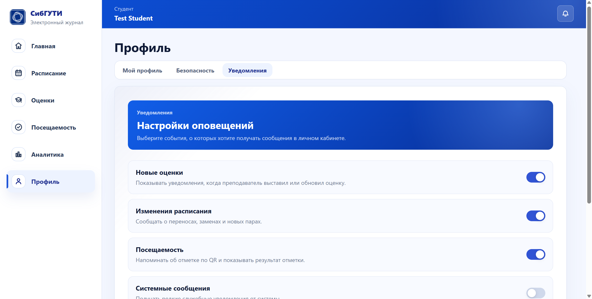
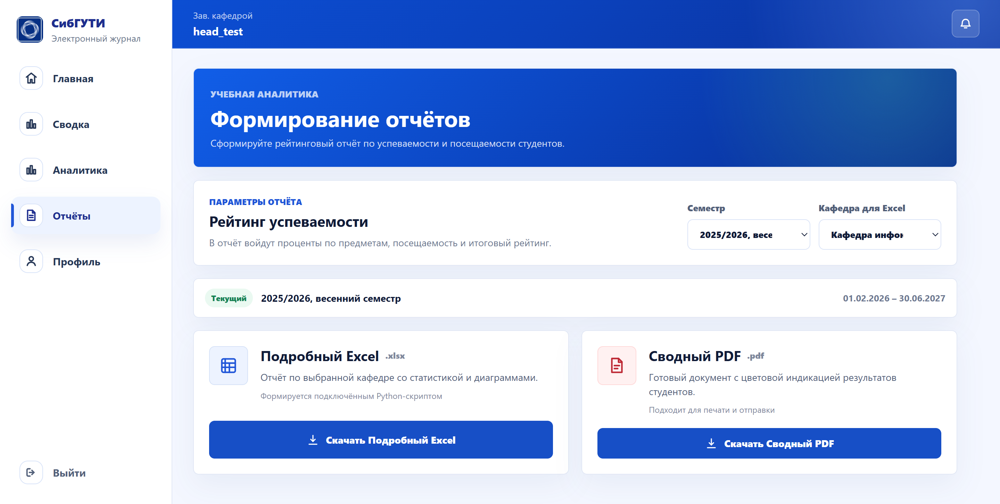
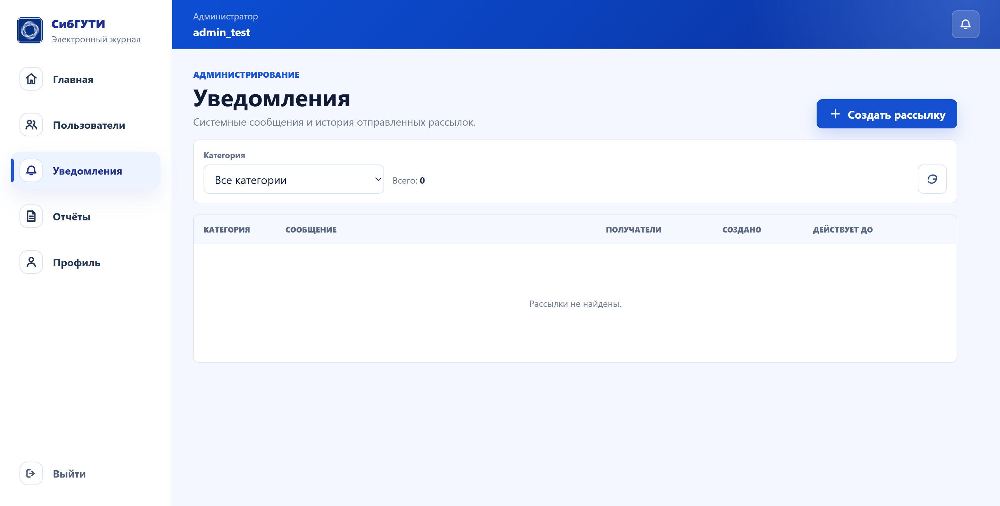
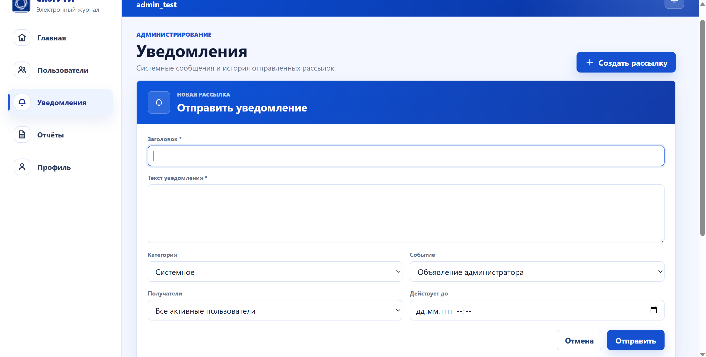

# **Отчёт по фронтенду 21.08**

## **Цели недели**

1. Подключить уведомления для всех ролей пользователей.
2. Добавить администратору создание и отправку уведомлений.
3. Реализовать индикацию непрочитанных сообщений и возможность отмечать их прочитанными.
4. Подключить формирование отчётов для преподавателя и административных ролей.

## **Выполненная работа**

### **Уведомления пользователей**

Система уведомлений была подключена к личному кабинету пользователей. В правом верхнем углу интерфейса добавлена кнопка с иконкой колокольчика. Если у пользователя есть непрочитанные сообщения, элемент получает активное состояние и показывает наличие новых уведомлений.

При открытии списка пользователь может прочитать полученные сообщения. После просмотра уведомление отмечается прочитанным, а индикатор непрочитанных сообщений обновляется.

В профиле пользователя доработана вкладка «Уведомления». В ней можно настроить получение сообщений по отдельным категориям:

- новые и изменённые оценки;
- изменения расписания;
- посещаемость;
- системные сообщения.

Настройки сохраняются через backend и восстанавливаются после повторного входа в систему.

### **Управление уведомлениями в административной панели**

Для администратора был добавлен отдельный раздел «Уведомления». В нём отображается история созданных рассылок и предусмотрена фильтрация по категориям.

Администратор может создать новую рассылку и указать:

- заголовок;
- текст уведомления;
- категорию;
- связанное событие;
- группу получателей;
- срок действия сообщения.

В качестве получателей можно выбрать всех активных пользователей или ограничить аудиторию рассылки. После отправки уведомление становится доступно выбранным пользователям в личном кабинете.

### **Индикация непрочитанных сообщений**

Frontend подключён к отдельному счётчику непрочитанных уведомлений. Состояние колокольчика обновляется при загрузке приложения и после чтения сообщений.

Для работы интерфейса используются backend-ручки получения уведомлений, счётчика непрочитанных сообщений, отметки одного сообщения прочитанным и массовой отметки сообщений.

### **Формирование отчётов**

В интерфейс был добавлен новый раздел «Отчёты». Он доступен преподавателю, заведующему кафедрой, декану и администратору с учётом области доступа каждой роли.

На странице можно:

- выбрать семестр;
- выбрать предмет для преподавательского отчёта;
- выбрать кафедру для сводного отчёта;
- скачать подробный отчёт в формате XLSX;
- скачать сводный документ в формате PDF.

Excel-отчёт формируется Python-скриптом на стороне backend. Скрипт получает данные из базы через API общего рейтинга и создаёт таблицы, аналитику и диаграммы. PDF формируется штатным серверным генератором.

Для преподавателя используется отчёт по выбранному предмету. Для заведующего кафедрой, декана и администратора формируется сводка в пределах доступной кафедры или организационной области.

Backend дополнительно проверяет роль пользователя и не позволяет сформировать отчёт по чужому предмету или кафедре.

### **Исправления генерации XLSX**

Во время проверки на реальной тестовой базе был обнаружен случай, когда у предмета отсутствуют практические работы. Из-за пустого диапазона колонок преподавательский XLSX не создавался.

Обработка пустых разделов была исправлена. После изменения отчёты корректно создаются даже при отсутствии лекций, лабораторных или практических работ.

## **Проверка**

Функциональность была проверена на настоящей backend-базе проекта.

Выполнены следующие проверки:

```bash
go test ./internal/httpserver ./internal/app
npm run build
```

Также отдельно проверено:

- получение уведомлений пользователями;
- создание рассылки администратором;
- изменение счётчика непрочитанных сообщений;
- формирование преподавательского XLSX;
- формирование кафедрального XLSX;
- формирование сводного PDF;
- открытие файлов в Excel и просмотрщике PDF.

## **Демо**

### Настройки уведомлений пользователя



### Формирование отчётов



### Раздел уведомлений администратора



### Создание рассылки



## **Планы на следующую неделю**

1. Реализовать backend-ручку посещаемости для аналитики студента.
2. Подключить полученные данные к режиму «Посещаемость» на странице аналитики.
3. Добавить отображение посещаемости по предметам и проверить расчёт процентов на реальных данных.
4. Добавить преподавателю страницу расписания на основе новой backend-ручки. Интерфейс должен быть близок к студенческому расписанию и показывать пары преподавателя, группы, предметы, время и аудитории.
5. Добавить в административную панель управление семестрами: просмотр текущего статуса, открытие и закрытие семестра с подтверждением действия.
6. Нужно будет сделать преподу описание такое же как и любому студенту (почти идентично что и студенту чтоб видеть пары), т.к. ручка появилась
7. Сделать возможность открывать и закрывать семестры админу
